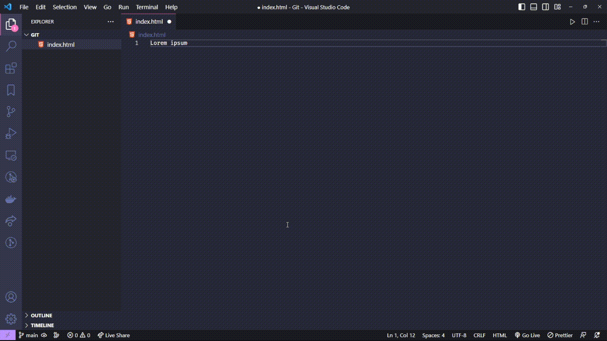
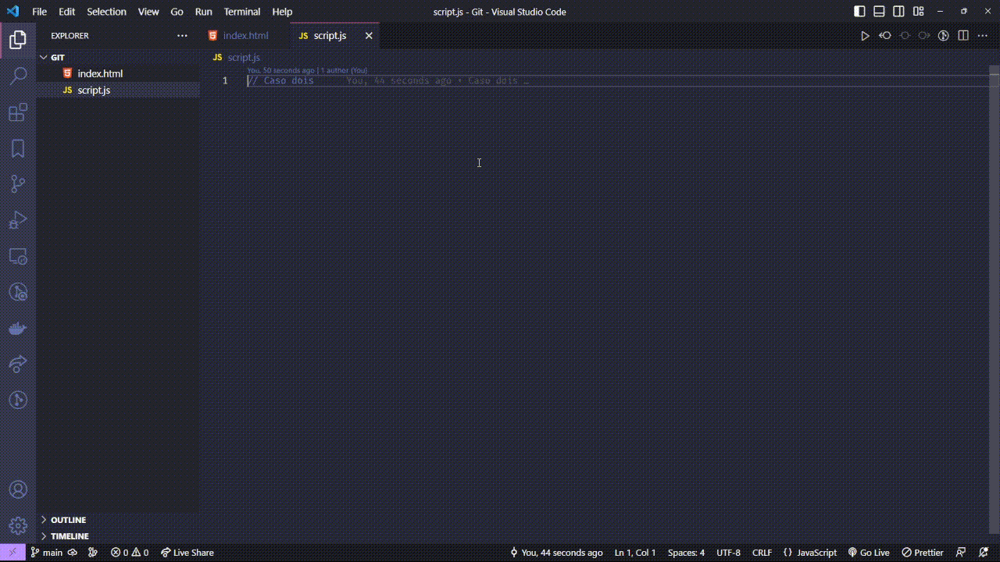

# Git stash

Acredito que você já passou pelo caso de sem querer fazer umas alterações no ramo principal do projeto 
e depois notar o que estava trabalhando na branch principal, provavelmente no começo você pode ficar 
aflito ou nervoso por não saber o que fazer nessa situação, ou pode ter ficado chateado por ter cometido 
um erro bobo por falta de atenção, onde você escreveu multipas alterações onde não devia. Agora você 
tem um problema, você precisa pegar todas as alterações que fez e colocar em uma nova branch.

Se isso nunca ocorreu com você, pode ter certeza que é só uma questão de tempo ate isso acontecer, e em caso raro de
disso nunca acontecer com você, certamente um colega de trabalho ou amigo da faculdade vai fazer então, então para que
possamos nós ajudar e ajudar nossos colegas e amigos, aprender nunca é demais.

Para deixar claro, a partir de agora eu vou referenciar o ramo principal do projeto como main, 
em alguns projetos (como esse) ele vai variar de main para master, mas nunca muito diferente disso, no fim é o ramo principal, 
saiba o porque da convenção mais apropriada ser main e não master [aqui](https://blog.curso-r.com/posts/2020-07-27-github-main-branch/).

Partindo do pressuposto que você usa o VSCODE ou um software de desenvolvimento moderno e você 
ainda não comitou nada, provavelmente o seu software preferido vai te mostrar em um feedback 
visual de quais foram as linhas que você alterou, retirou ou adicionou no código, mas definitivamente 
vai ser um saco copiar cada alteração para um bloco de notas da vida apenas para criar uma nova branch 
e continuar o trabalho.

Pior ainda se você já fez multiplos commits e não lembra a exata coisa que fez em cada alteração que fez, apenas comitou e 
continuou programando normalmente. Agora, teoricamente, você vai ter que ver a diferença de todos os commits anteriores,
verificar suas alterações atuais e teoricamente copiar tudo manualmente para outro arquivo de para guardar as 
alterações como um bloco de notas, resetar tudo novamente ate o commit que não tem nenhuma nova implementação 
e SÓ ENTÃO criar uma nova branch e colar todas novas implementações manualmente, um processo bem ~~chato~~ incômodo.

Felizmente o Git nos ajuda nesses tipo de problema, o comando `git stash` transforma esse processo 
repetitivo e maçante de copia e cola em algo rápido e simples com poucos comandos.

*Show champs mas como funciona o comando?*

Vou te explicar, o comando `git stash` pega todas as alterações que você fez que está
na sua working tree e no seu staged e guarda.

Para clarear a ideia irei te mostrar como esse comando é útil, no primeiro caso onde nós cometemos 
o erro de fazer um monte de alterações na  `main` mas não comitamos nada é bem fácil de resolver, 
pois, todas alterações estão ainda na working tree do Git, basta rodarmos o comando `git stash` para 
pegar todas essas alterações feitas e guardar no seu stash, criar uma nova branch, entrar 
nela e rodar o comando `git stash pop`, esse comando vai pegar o ultimo stash salvo e colocar
todas as alterações na nova branch. Vou te mostrar como fiz cada passo a seguir.



O que fizemos no exemplo acima?

```shell
# 1: Notamos que estamos na **`main`** e devemos colocar todas alterações em outra branch afim de separar o trabalho.

git stash
# 2: Pegamos todas alterações que fizemos.

git checkout -b nova_branch
# 3: Criamos uma branch chamadad nova_branch e fomos ate ela.

git stash pop
# 4: Colocamos todas as novas alterações na branch.
```

Já no segundo caso, onde já tinhamos feito varios commits na main para uma nova funcionalidade (por exemplo), 
seria bem tabalhoso ver a diferença de cada commit, copiar para um arquivo novo, resetar tudo e colocar 
tudo manualmente em uma nova branch, mas agora isso não é mais um grande problema, apenas com poucos 
comando e o `git stash` é possivel ter tudo perfeito.

Segue o exemplo pratico abaixo:



O que fizemos no exemplo acima?

```shell
# 1: Estamos desenvolvendo normalmente, comitando a cada nova funcionalidade.

# 2: Percebemos que estamos na branch errada, na main.

git reset --soft HEAD~2
# 3: Sabemos a quantidade de commits que fizemos, nesse caso dois commits, então voltamos dois commit mantendo as alterações no stage.

git stash
# 4: Pegamos todas alterações que fizemos.

git checkout -b branch_trabalho
# 5: Criamos e entramos na nova branch chamada branch_trabalho.

git stash pop
# 6: Aplicamos todas as novas alterações que fizemos.
```
## OBS:

É importante ressaltar que o comando `git stash` não salva realmente, ele inicialmente apenas **guarda**.

Tenha isso claro na sua mente, pois caso você faça uma alteração, rode o `git stash`, comece
a fazer outra alteração diferente e rode novamente o `git stash`, esse ultimo sobrescreverá seu antecessor. 

Eu recomendo que você veja esse comportamento na prática, siga os passos:

- Crie uma nova pasta
- Execute o comando `git init` para executar seu repositório local
- Crie um arquivo `index.html` com `head` e `body`
- Faça um commit 
  - `git add .`
  - `git commit -m "Adicionando html"`
- Agora adicione a tag `<div>Testing</div>`
- Execute o comando `git stash`
- Perceba que essa sua div sumiu, ela agora está no stash
- Para ter certeza rode um `git stash pop`
  - Voce perceberá que a sua div voltou
- Execute novamente o `git stash` a fim de guardar novamente a div
- Adicione a tag `<p>Paragrafo</p>`
- Execute novamente o comando `git stash` para guardar a tag p.
- Agora se você rodar um `git stash pop` ele vai aplicar o paragrado, pois ele sobrescreveu 
o stash antecessor, nesse caso a div.

Para manter os stashs é necessário usar o comando `git stash save <NOME_DO_STASH>` para cada stash que quiser salvar. 

Cada stash salvo fica em uma lista que você pode verificar com `git stash list`.

Assim que você salva um stash o Git gera um hash para ele, que você pode aplicar quando quiser 
usando o comando `git stash apply <HASH>`

Vamos testar na pratica ainda com a pasta que você criou:

- Apague o pagrafo que você adicionou
- Execute o comando `git stash list`
  - Você perceberá que ele não vai retornar nenhuma informação, pois você não salvou nenhum stash, vamos fazer isso agora.
- Adicione uma tag `<h2>Hello World</h2>` no `index.html`
- Execute o comando `git stash save tag_h2` para salvar o stash
  - O `tag_h2` tem como objetivo definir um nome para o stash, ele poderia ser qualquer nome e é um parametro opcional, 
  mas é muito util quando você for procurá-lo na lista depois.
- Execute o comando `git stash list`
  - Agora você perceberá que existe um stash salvo na sua lista de stash, você pode aplicar ele quando quiser, os stashs
    ficam armazenados no repositório até serem deletados.
- Para aplicar o stash execute o comando `git stash apply 0`
  - Nesse caso o `0` é para indicar o indice do stash que você quer da lista
  - Após rodar esse comando perceberá que a div foi aplicada normalmente

O comando `git stash` pode ser útil em varios casos diversos e definitivamente é uma comando
poderoso para se ter ciência, vale a pena conferir na [documentação](https://git-scm.com/docs/git-stash) 
para aprender mais sobre esse comando.